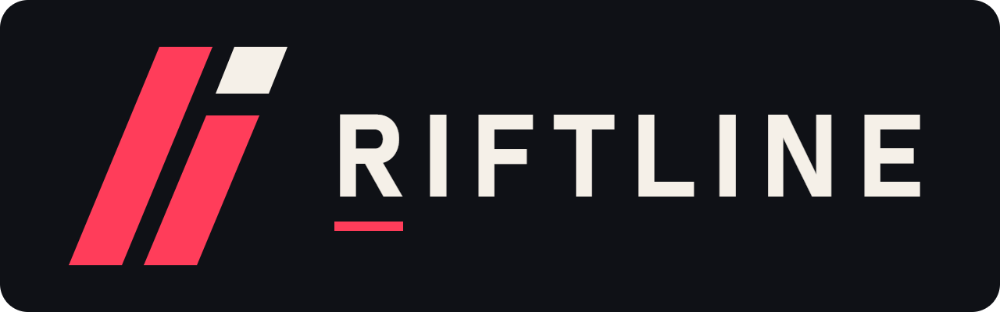

<p align="center"></p>

**Riftline** is a tactical 3D shooter for **1v1 and 2v2** online with friends, played in first person. It's round-based, with abilities, an economy, and a Valorant-style spike mode. It's also peer-to-peer, so there's **no server to run**, and it updates itself.

*A Camel Studios game.*

## ▶ Download & play

1. Go to **[Releases → latest](../../releases/latest)**
2. Download one of these:
   - **`Riftline-Portable-x.x.x.exe`**: no install, just double-click and play
   - **`Riftline-Setup-x.x.x.exe`**: installs it with a desktop shortcut
3. If Windows SmartScreen says *"Windows protected your PC"*, click **More info → Run anyway** (the game isn't code-signed).

Everyone needs the **same version**. If versions don't match, the game tells you.

## 🎮 Ways to play

| | |
|---|---|
| **Quick Play** | Matchmaking: finds another player automatically. No code needed. 1v1 or 2v2 (empty 2v2 slots fill with bots after 40s). |
| **Create Room / Join Room** | Private match with friends using a 6-letter code. Up to 4 players. Bots fill empty slots. |
| **Play vs Bots** | Offline, 1v1 or 2v2 with a bot teammate, on Easy, Normal or Hard. |
| **Practice Range** | Target dummies at 10, 20, 30 and 50m. Free guns, no cooldown pressure. |

No port forwarding is needed. If a direct connection is blocked by a strict network, the game falls back to public relay servers.

## Game modes

- **Spike** (Valorant-style): attackers carry the spike and plant it at site **A** or **B** (hold **F**, 4s). Defenders must stop the plant or defuse it (hold **F**, 7s) before it detonates (40s). The sides swap at halftime and credits reset.
- **Elimination**: wipe out the other team to win the round.

Both modes are round-based: one life per round, 100-second rounds, and the first team to 5, 7 or 9 rounds wins.

## Economy & buy phase

- Each round starts with a **10-second buy phase** (15 in the first round). Press **B** to buy. Your team is held behind a barrier until the round starts.
- Credits: win ¤3000, loss ¤1900 (+¤500 per loss in a row), kill ¤200, spike plant ¤300. You start with ¤800, and credits cap at ¤9000.
- **Shields**: the Light Shield gives +25 (¤400) and the Heavy Shield +50 (¤1000). Both absorb damage before your health does.
- **Dropped guns**: when someone dies, their gun drops. Press **F** to pick it up, or **G** to drop yours for a teammate. If you survive a round, you keep your loadout.

## Agents

| Agent | Role | Q | E | X (ultimate) |
|---|---|---|---|---|
| **Blaze** | Assault | Dash | Firebomb | Rocket |
| **Tank** | Heavy | Barrier | Fortify | Earthquake |
| **Ghost** | Infiltrator | Blink | Shadow Smoke | Phantom (invisible) |
| **Volt** | Gunner | Overclock | Chain Lightning | Thunderstorm |
| **Frost** | Controller | Ice Wall | Frost Nova | Deep Freeze |
| **Nova** | Medic | Mend | Healing Field | Revive |
| **Echo** | Recon | Pulse | Trip Mine | Overwatch |

Q and E recharge over time. The ultimate charges from kills, rounds, plants and defuses.

## Weapons

Pistol (free) · Shorty ¤300 · Machine Pistol ¤500 · Hand Cannon ¤900 · Stinger ¤1100 · SMG ¤1500 · Shotgun ¤1800 · Scout ¤1100 · Carbine (bullpup) ¤2100 · Marksman ¤2500 · Assault Rifle ¤2900 · LMG ¤3200 · Sniper ¤4200

## Store & Locker

Every match earns **◈ coins**: 50 per match, +100 for a win, +10 per kill and +5 per round won. The **Store** has a featured skin and 6 daily offers that change every day. The **Locker** is where you equip the skins you own. Your friends see your skins in matches, and if you drop your gun they can pick it up with your skin on it.

Skins: Carbon · Arctic Camo · Tiger · Toxic · Oceanic · Neon Pulse · Solid Gold · Dragonfire · Galaxy

## Updates

Install with **Riftline-Setup** and the game updates itself: it checks GitHub for a new version when it starts, downloads it in the background, and a green **Restart to update** button appears on the main menu. If you close the game instead, the update installs when you quit. The **Portable** exe also updates itself (it downloads the new portable exe next to the old one and switches to it).

## Riftline ID

The first time you open the game you create a **Riftline ID**: a username plus a #tag (like `Camel#CMLS`). Click your ID on the main menu to change it. Your ID shows in lobbies and on the scoreboard.

## Quick Play

Pick your agent on the Quick Play screen, then Find Match. When the match is full you get a 10 second agent select where you can still switch.

## Maps

Every map is a full-size spike map (about 120m x 88m): attackers start west, defenders east, with an A site and a B site that each have their own look.

- **Bastion**: a sunny hill town. A long street to A with a raised heaven, a pillared courtyard mid, and a covered market into B.
- **Foundry**: a steel plant. A is a roofed smelter hall with a vent flank, mid is the furnace room, B is an open container yard with a catwalk.
- **Skyline**: neon rooftops at night. Bridges over the drop, a raised helipad A, an interior corridor under the mid skybridge, a rooftop garden B.
- **Canyon**: a desert temple on a mesa (A), a chasm mid with two rope bridges, and a cave tunnel into the mining camp (B).
- **Harbor**: docks. A is on the deck of a cargo ship, mid is a container maze, B is a roofed warehouse with racks.
- **Citadel**: a temple at dusk. A cloister leads to the throne hall (A), a grand stair climbs to the mid plaza, B is a fountain garden.
- **Range**: practice targets at 10, 20, 30 and 50m.

## Controls

| Action | Key |
|---|---|
| Move / Jump / Walk | W A S D / Space / Shift |
| Fire / Aim down sights | Left / Right click |
| Abilities / Ultimate | Q · E / X |
| Reload | R |
| Primary / Sidearm | 1 / 2 (or mouse wheel) |
| Buy menu | B |
| Pick up gun, or hold to plant/defuse | F |
| Drop gun | G |
| Scoreboard | Tab |
| Back out of menus | Esc |
| Inspect weapon | Y |
| First / third person | V |
| Pause / Fullscreen | Esc / F11 |

---

## Development

```bash
npm install
npm start          # run the game (Electron)
npm run serve      # or play in a browser at http://localhost:5178
npm run build      # build the installer + portable exe into dist/
```

Built with [three.js](https://threejs.org) and [PeerJS](https://peerjs.com). All models, textures, skins and sounds are generated in code.

Pushing a tag like `v2.2.1` makes GitHub Actions build the Windows `.exe` files and attach them to a new Release.
